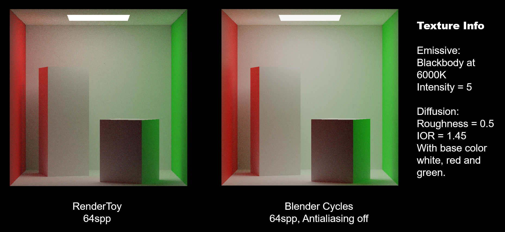

# RenderToy
RenderToy is an experimental path tracing rendering library for academic purposes.

## We implement:
* Highly abstracted mathematics module.
* Modern color system with multiple color standards.
    * ITU-R BT.709
    * ITU-R BT.601
    * ITU-R BT.2020
    * SMPTE 240M
* Fully multi-threaded path-traced GI.
    * Direct Light Sampling (DLS).
        * It also produces fast-GI results.
    * Disney PBR BSDF.
    * Multiple importance sampling (MIS).
* Triangulated mesh system.
    * Bounding Volume Hierarchy (BVH) acceleration structure.
* Physically-based perspective camera.
    * Presets:
        * Academy Format.
        * IMAX HD.
        * Maxivision.
* Multi-pass ray-casting renderer, including normal pass, albedo pass & depth pass.
    * Can be linked with denoising library such as OIDN & Nvidia OptiX.
* Physically-based principled BSDF material system.
* Procedural Texture.
    * Checkerboard.
    * Wave.
* A compositor for post-processing.
    * Gaussian blur.
    * Convolution with customized kernels.
    * Edge detection.
    * Bloom.
* File IO.
    * Importing wavefront OBJ model file.
    * Exporting PPM & BMP image file.

## Getting Started
Pre-requirements:
* CMake 3.10+
* GNU G++ 9.4.0+ or Clang++ 10.0.0+
> Currently Clang++ could not compile RenderToy, since Clang++ provides about 20% speed improvement, this is not intended, we are looking into this issue.

Meanwhile we recommend you use VSCode as it is well integrated with CMake. After opening the project directory in VSCode, press Ctrl+Shift+P then enter CMake: Configure - VSCode will do everything you need.

## Launch Targets
* Tests - Unit test module for the project.
* CornellBox - A demo rendering the famous Cornell Box scene.
* WithOIDN - (WIP) A demonstration of Intel® Open Image Denoise integration.
* ProceduralTexture - A demo rasterizing procedural textures supported by RenderToy.
* Interactive - (WIP) Live preview demo on X11.
* TestRenderer - Just a test.

## Features
* Unique project structure, unlike any other open source ray tracers.
* High abstraction.
* Extensive adoption of compile-time code like SFINAE etc.
* Provides a variety of interfaces for secondary development.

## Our plan:
* Procedural texture and mesh module.
* A richer compositor.
* Importing SDR/HDR texture image.
* Exporting HDR image.
* Physical sky.
* Code optimization.

## License
MIT.

## Reference
* GLSL Path Tracer by knightcrawler25 (https://github.com/knightcrawler25/GLSL-PathTracer) and its simplified port on ShaderToy by Asif Ali (https://www.shadertoy.com/view/sltXRl). Their designs were referenced for the Disney PBR portion of this project.
* Color standards from ITU-R (http://www.itu.int/rec/) and Andreas Paul from Dept of Informatics,  Technical University of Munich (https://www5.in.tum.de/lehre/vorlesungen/graphik/info/csc/COL_33.htm).
* Minilight: A minimal global illumination renderer by HXA7241 (https://www.hxa.name/minilight/). It had an important impact on the structural design of this project.
* Smallpt: Global Illumination in 99 lines of C++ (https://www.kevinbeason.com/smallpt/). Excellent demo for learning path tracing.
* Blender (http://blender.org/). The demo model for this project was created using Blender. And many designs, such as the compositor and PCG part, draw inspiration from Blender.
* Blackbody converter from Christopher J. Howard (https://www.shadertoy.com/view/tsKczy). MIT License. Copyright (c) 2020 Christopher J. Howard.
* RGB/XYZ Matrices by Bruce Justin Lindbloom (http://www.brucelindbloom.com/index.html?Eqn_RGB_XYZ_Matrix.html).
