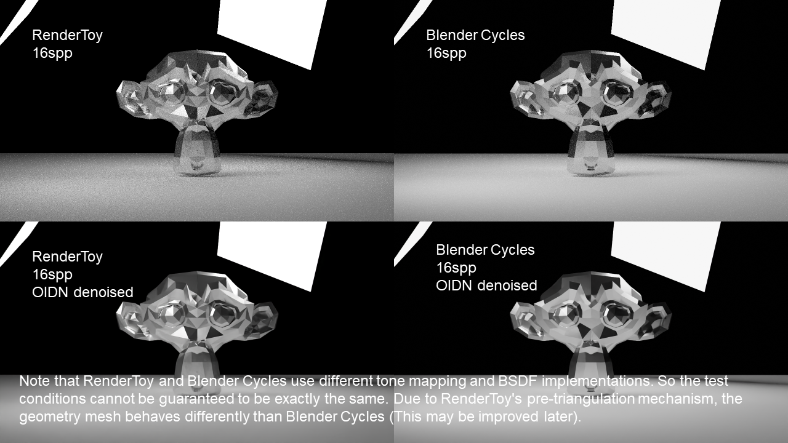
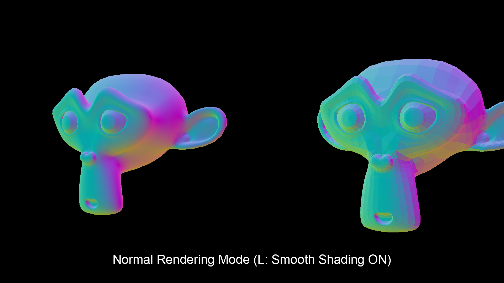

# RenderToy
RenderToy is an experimental path tracing rendering library for academic purposes.

[comment]: # (
    你说得对，但是 RenderToy 是一款全新的「基于物理的路径追踪软件渲染器」。渲染发生在一个被称作「标准化设备坐标系」的幻想世界，在这里，被「包围体积层次」和「穆勒-朗博算法」选中的光线将被授予「多重重要性采样」，导引「蒙特卡洛方法」。你将扮演一位名为「辐射度」的神秘角色，在自由的旅行（有六个自由度）中邂逅几何特征各异、材质独特的三角形们，和他们一起击败噪声，找回失散的概率密度函数——同时，逐步发掘「全局光照」的真相。
    除了上述的介绍以外，RenderToy 还同时内置了「过程化生成」和「后期处理」模块。为了服务后期处理模块，RenderToy 引入了包括像素级处理（黑白和目标提取等）和卷积处理（快速高斯模糊和边缘查找等）在内的图像处理能力。
    出于兼容性、开发成本和开源软件协议的考虑（这是非常现实的问题，如果要支持图形界面，那么对于即时呈现部分，要么1开发一套全新的栅格化渲染系统，要么2调用 OpenGL 或者 DirectX，要么3采用支持现代图形库的开发框架如 Qt 等。1几乎要写一个和已有光线追踪技术等代码量的模块，鉴于目前项目代码行数已经破4000，这带来的开发成本太大了；2会带来大量的兼容性问题，而且一旦引入例如 OpenGL 在内的图形库，本项目的很多模块，例如摄像机矩阵和求交等，都会与 OpenGL 内部已有的方法产生冲突，贸然建立 Wrapper 会带来代码重复，并且极大影响性能；3如果使用Qt等较成熟的图形化框架，又会污染本项目的 MIT 协议），除了采用 X11 的「Interactive」演示程序以外，RenderToy 以静态链接库的形式存在，不内置图形界面，其他的演示程序也均采用标准输入输出流。
    详情请看英文文档。
)

## We implement:
* Highly abstracted mathematics module.
* Modern color system with multiple color standards.
    * ITU-R BT.709
    * ITU-R BT.601
    * ITU-R BT.2020
    * SMPTE 240M
* Fully multi-threaded path-traced GI.
    * Direct Light Sampling (DLS).
        * It also produces fast-GI results.
    * Disney PBR BSDF.
    * Multiple importance sampling (MIS).
* Triangulated mesh system.
    * Bounding Volume Hierarchy (BVH) acceleration structure.
* Physically-based perspective camera.
    * Presets:
        * Academy Format.
        * IMAX HD.
        * Maxivision.
* Multi-pass ray-casting renderer, including normal pass, albedo pass & depth pass.
    * Can be linked with denoising library such as Intel® OIDN & Nvidia OptiX™ AI-Accelerated Denoiser. The image buffer pointer can be directly passed to OIDN.
* Physically-based principled BSDF material system.
* Procedural Texture.
    * Checkerboard.
    * Wave.
    * Perlin Noise.
* A compositor for post-processing.
    * Gaussian blur.
    * Convolution with customized kernels.
    * Edge detection.
    * Bloom.
* File IO.
    * Importing wavefront OBJ model file.
    * Exporting PPM & BMP SDR image file.

## Getting Started
Pre-requirements:
* CMake 3.10+
* GCC 9.4.0+ or Clang 10.0.0+
* OpenMP (Modern version of GCC & Clang have OpenMP builtin)
* Catch2 3.2.1+ (for unit tests)
* libx11-dev 1.6.9+ (for Interactive demo)

> Intel® OIDN used by denoising demo has special hardware requirements. Please refer to https://www.openimagedenoise.org/ for more info. **This does not affect the compilation of RenderToy library itself.**

LLVM Clang is recommended to compile the project.

Meanwhile we recommend you use VSCode as it is well integrated with CMake. After opening the project directory in VSCode, press Ctrl+Shift+P then enter CMake: Configure - VSCode will do everything you need.

## Launch Targets
* Tests - Unit test module for the project.
* CornellBox - A demo rendering the famous Cornell Box scene.
* WithOIDN - (WIP) A demonstration of Intel® Open Image Denoise integration.
* ProceduralTexture - A demo rasterizing procedural textures supported by RenderToy.
* Interactive - (WIP) Live preview demo on X11.
* TestRenderer - Just a test.
* SmoothShading - A demonstration of smooth shading.

## Render Results & Comparison






## Features
* Unique project structure, unlike any other open source ray tracers.
* High abstraction.
* Extensive adoption of compile-time code like SFINAE etc.
* Provides a variety of interfaces for secondary development.

## Our plan:
* Procedural texture and mesh module.
* A richer compositor.
* Importing SDR/HDR texture image.
* Exporting HDR image.
* Physical sky.
* Code optimization.

## License
MIT.

## OSS Usage
```
--------
siv::PerlinNoise
Perlin noise library for modern C++
MIT License.
Copyright (C) 2013-2021 Ryo Suzuki <reputeless@gmail.com>
--------
Blackbody Converter
MIT License.
Copyright (c) 2020 Christopher J. Howard.
--------
```

## Reference
* GLSL Path Tracer by knightcrawler25 (https://github.com/knightcrawler25/GLSL-PathTracer) and its simplified port on ShaderToy by Asif Ali (https://www.shadertoy.com/view/sltXRl). Their designs were referenced for the Disney PBR portion of this project.
* Color standards from ITU-R (http://www.itu.int/rec/) and Andreas Paul from Dept of Informatics,  Technical University of Munich (https://www5.in.tum.de/lehre/vorlesungen/graphik/info/csc/COL_33.htm).
* Minilight: A minimal global illumination renderer by HXA7241 (https://www.hxa.name/minilight/). It had an important impact on the structural design of this project.
* Smallpt: Global Illumination in 99 lines of C++ (https://www.kevinbeason.com/smallpt/). Excellent demo for learning path tracing.
* Blender (http://blender.org/). The demo model for this project was created using Blender. And many designs, such as the compositor and PCG part, draw inspiration from Blender.
* RGB/XYZ Matrices by Bruce Justin Lindbloom (http://www.brucelindbloom.com/index.html?Eqn_RGB_XYZ_Matrix.html).
* Scratchapixel: A free educational site that progressively introduces you to the world of computer graphics. (https://www.scratchapixel.com/)
